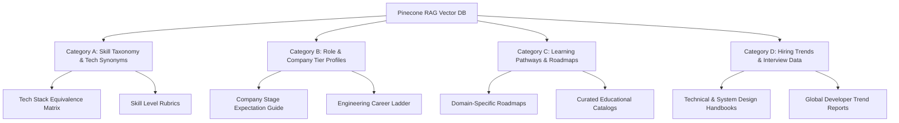

# readmycareer.com

> **PoC** — AI-powered career gap analysis and roadmap generator for tech professionals.

Upload your resume, paste a job description, and get a personalized week-by-week career plan built by a multi-agent AI pipeline — then generate an ATS-optimized resume once you've completed the plan.

---

## Overview

**readmycareer.com** is a proof-of-concept application that demonstrates how a multi-agent LLM system can accelerate career transitions in the tech industry.

The base model is **Gemini 3.1 Flash Lite** (free tier). This model was chosen with Gemini's multimodal generation capabilities in mind as a foundation for future enhancements — richer resume parsing, visual portfolio analysis, and document generation.

## Background & Intent

The existing career recommendation approach lacked contextual understanding, creating a need for an AI product that derives personalized career plans based on user resumes and job descriptions.

Traditional recruiting platforms and career recommendation systems rely heavily on simple keyword matching (ATS) or superficial analyses of job descriptions. Consequently, they fail to grasp the **multidimensional context of the job market**. To address this gap, readmycareer.com deeply analyzes the relationship between a user's resume and a specific job description, generating an organic, personalized, and highly actionable week-by-week career roadmap via a multi-agent AI system.

### 1. Key Areas of Contextual Gaps in the Job Market

Traditional keyword-based matching between a resume and a job description (JD) fails to capture critical dimensions of professional development. These contextual gaps typically manifest in five key areas:

1. **Technical Terminology & Stack Mismatch**
   - Candidates and hiring organizations often describe identical technologies or concepts using different terms (e.g., `Web Components` vs `React/Vue`, `Container Orchestration` vs `Kubernetes`, or `RAG` vs `Semantic Search`).
   - Traditional matchers fail to evaluate the **transferability of skills**—such as recognizing that hands-on experience with AWS ECS translates effectively to a GCP Cloud Run environment.
2. **Hidden & Implicit Expectations**
   - A job description might only list elementary requirements like "Java, Spring Boot, MySQL." However, depending on the company's scale and the position's seniority, there are unspoken expectations (e.g., distributed system design, caching with Redis, message queuing with Kafka, and automated CI/CD pipelines for senior roles).
   - Simple text matching gives candidates a distorted signal that merely listing the basic keywords is sufficient for a successful application.
3. **Company Stage & Culture Fit**
   - Early-stage startups (e.g., Series A) prioritize agile "generalists" who can wear multiple hats across frontend, backend, and infrastructure to build and iterate MVPs rapidly.
   - Conversely, enterprises and unicorn companies look for "specialists" who excel in large-scale traffic optimization, adherence to rigorous software development standards, and cross-functional coordination.
   - Career plans that ignore these organizational contexts result in unrealistic milestones.
4. **Skill Lifecycle & Market Trends**
   - The market value and relevance of technologies shift rapidly (e.g., deep expertise in legacy, boilerplate-heavy Redux is often less valued today than proficiency in modern reactive state management or React Server Components).
   - Systems must filter out obsolete requirements copy-pasted from years-old job templates and prioritize skills actively valued in the current ecosystem.
5. **Unstructured Progression Trajectories**
   - A naive matching engine might detect a gap in "Kubernetes" and immediately push it as a high-priority task, failing to recognize that recommending Kubernetes to a candidate who lacks fundamental containerization (Docker) or CI/CD experience creates an overwhelming and impractical roadmap.

---

### 2. Proposed RAG Reference Architecture & Inventory

To bridge these contextual gaps, we propose seeding the **Pinecone RAG Vector DB** with standard industry references. This external knowledge base empowers the orchestrating agents (GapAnalyzer, Planner, and ResumeOptimizer) to make grounded inferences.



#### Category A: Technology Taxonomy & Synonyms
*   **Objective**: Standardize technology terminology, resolve synonym mismatches, and map the transferability of skills across different ecosystems.
*   **Key Inventory Resources**:
    1.  **Tech Stack Equivalence Matrix**: A mapping database for multi-cloud alternatives (e.g., AWS vs. GCP vs. Azure services) and comparable libraries across frontend/backend frameworks.
    2.  **Standard Developer Skill Taxonomy**: A hierarchical, tree-structured dictionary linking technology synonyms, shorthand terms, and closely related core concepts.
    3.  **Skill Level In-Depth Rubrics**: Practical criteria defining what constitutes "Basic," "Intermediate," and "Expert" competency for major tech stacks, moving beyond simple self-evaluations.

#### Category B: Role & Company Tier Profiles
*   **Objective**: Inject hidden expectations and cultural variables specific to company size, growth stages, and team dynamics.
*   **Key Inventory Resources**:
    1.  **Company Stage Specific Expectations Guide**: Guidelines delineating the differing weights of soft skills, generalist capacity, and specialist expertise expected at early-stage startups (Series A), scale-ups (Series B/C), and big tech enterprises.
    2.  **Standard Engineering Career Ladder**: Detailed capability matrices for Junior, Mid, Senior, Lead, and Principal tiers covering system design scope, business autonomy, and leadership criteria.
    3.  **Target Company Tech Stack & Culture Profiles**: Curated profiles outlining target company archetypes, their active engineering philosophies, standard deployment flows, and architectural conventions.

#### Category C: Skill Learning & Career Roadmaps
*   **Objective**: Supply structural guidelines so the Planner agent can sequence daily tasks, learning resources, and milestones logically.
*   **Key Inventory Resources**:
    1.  **Standard Domain Learning Pathways**: Structured curricula adapted from roadmap.sh for Frontend, Backend, DevOps, Data Engineering, and AI/ML, detailing strict prerequisite trees.
    2.  **Curated Learning Materials & Project Catalog**: A database of highly rated official documentation, textbooks, MOOCs, and guided capstone projects categorized by skill gap to ensure actionable, high-quality roadmap recommendations.

#### Category D: Hiring Trends & Interview Frameworks
*   **Objective**: Ensure the ResumeOptimizer agent emphasizes elements highly valued in modern screenings and prepares candidates for current tech evaluation formats.
*   **Key Inventory Resources**:
    1.  **Technical & System Design Interview Handbooks**: A collection of evaluation frameworks, core conceptual rubrics, and system architecture assessment criteria commonly used by modern hiring panels.
    2.  **Annual Tech Trend Reports Summary**: Synthesized data from industry surveys (e.g., Stack Overflow Developer Survey, State of JS/CSS, Gartner Hype Cycles) to deprioritize legacy skills and highlight emerging high-demand competencies.

---


## Features

| Feature | Description |
|---|---|
| **Resume parsing** | Upload PDF or DOCX; Gemini extracts structured JSON (skills, experience, education, certifications) |
| **Gap analysis** | Multi-phase comparison of resume vs. JD; outputs strengths, gaps, priority order, and a match score |
| **Career roadmap** | Week-by-week action plan with daily todos, milestones, and a Gantt timeline |
| **AI career coach** | Floating chat interface grounded in your resume, gap analysis, and career plan |
| **Resume optimizer** | After completing all checklist items, generates an ATS-optimized resume (highlights, cover letter, skills flat-list) |
| **Bilingual output** | All agent output respects `Accept-Language` — Korean and English supported |
| **Dashboard** | Authenticated users can save up to 3 career plans and revisit them via `/dashboard` |

---

## Architecture

```
readmycareer.com/              (pnpm monorepo)
├── app/                       Next.js 14 frontend + API routes
├── agents/                    Multi-agent orchestration layer (Google ADK) ← runtime
│   ├── gap-analyzer/          Phase-by-phase JD vs. resume comparison
│   ├── planner/               Week-by-week career plan generator
│   ├── chat-qna/              Context-aware career coach
│   ├── resume-optimizer/      ATS resume generation from completed plan
│   ├── lib/mcp-client.ts      Connection-pooled MCP stdio client
│   └── orchestrator.ts        Public API surface (runCareerAnalysis, runChatQnA, runResumeOptimizer)
└── mcp-skills/                MCP stdio subprocesses (spawned by agents/) ← runtime
    ├── career-knowledge-base/ Pinecone RAG search over career/tech corpus
    ├── career-plan-generator/ Structured plan JSON generation
    ├── pdf-word-to-json/      Resume text extraction and normalization
    └── resume-generator/      Gemini-powered ATS resume synthesis
```

> `agents/` and `mcp-skills/` are the only runtime packages. All other root-level directories (`eval/`, `documents/`) are development tooling and documentation.

### Gemini CLI workspace skills

`.gemini/skills/` contains workspace skills for [Gemini CLI](https://geminicli.com/docs/cli/skills/) — one skill per agent/subsystem. Each skill packages developer context (I/O specs, constraints, architecture notes) that Gemini activates when you ask it to work on that part of the codebase.

```
.gemini/skills/
├── gap-analyzer/      SKILL.md — gap analysis agent context
├── planner/           SKILL.md — career plan generator context
├── chat-qna/          SKILL.md — AI career coach context
├── resume-optimizer/  SKILL.md — ATS resume generation context
└── mcp-skills/        SKILL.md — MCP stdio subprocess development context
```

### Agent pipeline

```
[Resume Upload]  →  pdf-word-to-json (MCP)  →  ResumeJson
[JD Paste]       →  career-knowledge-base (MCP, Pinecone RAG)  →  JdSearchResult[]
                                        ↓
                          GapAnalyzerAgent  →  GapAnalysisOutput
                                        ↓
                            PlannerAgent    →  CareerPlanOutput
                                        ↓ (after all todos done)
                       ResumeOptimizerAgent →  OptimizedResumeOutput
```

Each step runs inside a **quality gate loop** (up to 3 retries) that validates schema compliance, plan completeness (≥3 todos/week), and date continuity before accepting a result.

---

## Tech Stack

### Frontend
- **Next.js 14** (App Router) + **React 18**
- **Tailwind CSS** + **Framer Motion** — Synthetic Intelligence design system
- **next-intl** — i18n (English / Korean)
- **Recharts** — Gantt / progress visualization
- **react-markdown** — Markdown rendering for resume and plan output

### Backend / API
- **Next.js API Routes** with **Server-Sent Events (SSE)** for streaming progress
- **Supabase** (PostgreSQL + Auth + Row-Level Security) — user auth, career plans, chat history, optimized resumes
- **pdf-parse** + **mammoth** — PDF and DOCX text extraction

### AI / Agents
- **Google Gemini 3.1 Flash Lite Preview** — base LLM for all agents and MCP skills
- **Google ADK (`@google/adk`)** — multi-agent runner with `InMemorySessionService`
- **Gemini Context Caching** — resume tokens cached for 1 hour to reduce repeat billing
- **MCP (Model Context Protocol)** — stdio subprocess pool for skill isolation and reuse
- **Pinecone** — vector database for career/tech industry RAG context
- **Zod** — runtime schema validation at every agent I/O boundary

### Tooling
- **pnpm workspaces** — monorepo package management
- **TypeScript 5** across all packages
- **Playwright** — end-to-end testing

---

## Roadmap

### Near-term
- **Hyperparameter tuning** — optimize temperature, topP, and max tokens per agent for better output consistency and quality
- **RAG-augmented gap assessment** — when a JD omits explicit skill requirements, use the Pinecone corpus to infer expected competencies for the role level and company tier, improving capability radar accuracy

### Medium-term
- **User profile & progress tracking** — persist skill growth, completed resources, and plan milestones across sessions to build a longitudinal career profile
- **Career plan refinement** — incorporate previous plan history and actual completion rates to produce more realistic and personalized next plans

### Long-term
- **Practical learning resource recommendations** — surface specific courses, projects, and open-source contributions tailored to identified gaps and the user's current level
- **Multimodal resume input** — leverage Gemini's multimodal capabilities for richer extraction from visual or image-heavy resumes and portfolios

---

## Getting Started

### Prerequisites

- Node.js ≥ 20
- pnpm ≥ 9
- A Supabase project
- A Google AI / Gemini API key
- A Pinecone API key and index

### Environment variables

Create `app/.env.local`:

```env
NEXT_PUBLIC_SUPABASE_URL=
NEXT_PUBLIC_SUPABASE_ANON_KEY=
GOOGLE_API_KEY=
PINECONE_API_KEY=
PINECONE_INDEX_NAME=
```

### Install and run

```bash
pnpm install

# Build all packages (agents + mcp-skills)
pnpm build

# Start the dev server
pnpm dev
```

The app will be available at `http://localhost:3000`.

> **Note:** After any source change in `agents/` or `mcp-skills/`, re-run `pnpm build` and restart the dev server. The `dist/` directories are gitignored and must be rebuilt locally.

---

## Changelog

See [CHANGELOG.md](./CHANGELOG.md) for the full version history.

---

## License

Private repository. All rights reserved.
